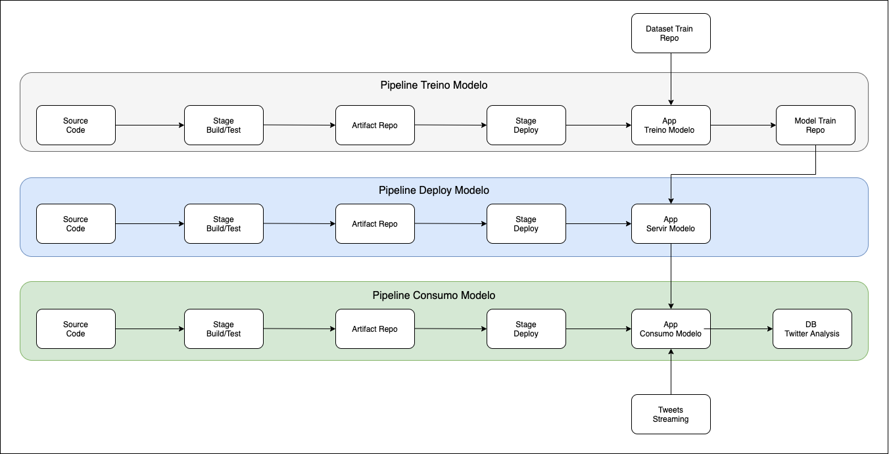

# Solução de Análise de Sentimentos de Twitters

O projeto traz uma abordagem para o desafio de implementar pipelines de deploy e consumo de um modelo utilizando uma Solucão Análise de Sentimentos de Twitters.
O modelo foi retirado da plataforma [Kaggle](https://www.kaggle.com) e iremos construir todos os pipelines necessários para o deploy do mesmo, assim como a refatoração dos códigos e construção de toda infra necessária.

## O Modelo

O modelo escolhido foi desenvolvido pelo [Paolo Ripamonti](https://www.kaggle.com/paoloripamonti) e o Jupyter Notebook com o todo o desenvolvimento dele estão disponiveis no [link](https://www.kaggle.com/paoloripamonti/twitter-sentiment-analysis).
O mesmo é construido em python utilizando técnicas como Word2vec e Keras para modelagem.
O modelo utiliza um dataset para treino com mais de 1,6 milhões de tweets pré-processados, que estão disponiveis dentro da plataforma do Kaggle.

## Proposta Macro



A solução foi dividida em 3 aplicações e 3 pipelines para deploy para manter os objetivos de cada camanda independentes, porém com recursos que possibilitam a intergração entre elas.

**Aplicacões:**

- **App Treino Modelo**: Aplicação utilizada para treinar o modelo com o dataset de treino.
- **App Servir Modelo**: Aplicação utilizada para servir o modelo treinado como serviço para outras aplicações.
- **App Consumo Modelo**: Aplicação utilizada para realizar streaming nos tweets, consumir o modelo treinado e disponibilizar os dados da análise.

**Pipelines:**

- **Pipeline Treino Modelo**: Responsável pelo deploy do **App Treino Modelo** que irá treinar o modelo e entregar o artefato final no repositório.
- **Pipeline Deploy Modelo**: Responsável pelo deploy do **App Servir Modelo** que irá servir o modelo treinado para consumo.
- **Pipeline Consumo Modelo**: Responsável pelo deploy do **App Consumo Modelo** que irá coletar novos dados via streaming, consumir o modelo de treino e disponibilizar o resultado no **DB Twitter Analysis**.

**Componentes:**

- **Source Code:** Componente com o objetivo de armazenar e versionar os códigos referente as aplicações.
- **Stage Build/Test**: Componente responsável por buscar o código fonte, testar e construir o artefato com as dependencias para a aplicação funcionar adequadamente.
- **Artifact Repo**: Componente para armazenar o artefato da aplicação.
- **Stage Deploy**: Componente responsável por realizar o deploy do artefato da aplicação no ambiente de execução.
- **Model Train Repo**: Componente para armazenar o modelo treinado.
- **Dataset Train Repo**: Componente para armazenar o dataset de treino.
- **API Consumer**: Componente que irá disponibilizar o modelo treinado via API.
- **DB Twitter Analysis**: Componente para armazenar o resultado da analises dos tweets.
- **Tweets Streaming**: Componente API do Twitter para streaming de tweets.

## Tecnologias


Nesse projeto adotamos as tecnologias abaixo:

- **Gitlab**: Responsável pelo componente **Source Code** do pipeline.
- **Gitlab CI**: Responsável pelos componentes **Stage Build/Test** e **Stage Deploy**.
- **GitLab Container Registry**: Responsável pelo componente **Artifact Repo**.
- **Cluster Kubernetes**: Será nosso ambiente onde as aplicacões irão rodar em containers. Os componentes **API Consumer** e **Streamer** são executados aqui.
- **AWS EC2**: Serão utilizadas 3 VM para o **Cluster Kubernetes**
- **AWS S3**: Responsável pelos componentes **Model Train Repo** e **Dataset Train Repo**.
- **AWS DynamoDB**: Responsável armazenar os resultados finais da análise de sentimentos dos tweets.

O conjunto das soluções do Gitlab foram escolhidas por terem integrações nativas entre elas. Assim facilitando de construção dos pipelines.
Estamos utilizando containers, pois nos ajuda a gerenciar melhor os nossos recursos e dependências de cada aplicação, além de ajudar no controle de versão e escalabilidade.

## Estrutura Aplicações e Pipelines

### Estrutura de Pastas

As 3 aplicações utilizam a mesma estrutura de pastas conforme abaixo:


- **app**: Pasta com os códigos da aplicação.
  - **libs**: Pasta com os modulos utilizados pela aplicação.
  - **main.py**: Arquivo python principal, que será rodado dentro do container realizando as chamadas nos modulos necessários.
- **build**: Pasta com os arquivos necessário para o build/deploy.
  - **kubeconfig**: Arquivo de configuração para gerenciamento do cluster kubernetes.
  - **manifest_app.yaml**: Arquivo YAML com as configurações para o deployment no kubernetes.
  - **requirements.txt**: Arquivo com as bibliotecas e versões necessárias para rodar a aplicação.
- **.gitlab-ci.yml**: Arquivo YAML utilizado pelo **Gitlab CI** para construção do pipeline.
- **Dockerfile**: Arquivo Dockerfile utilizado para construir a imagem container com a aplicação e suas dependências.

### Estrutura do Pipeline


- **Test_before_build**: Etapa para realizar validações de códigos e análise de vulnerabilidade.
- **Build**: Construção da imagem do container.
- **Pull_image**: Atualização da imagem no cluster kubernetes
- **Deploy**: Deploy da aplicação no cluster kubernetes.
- **Test_after_deploy**: Testes funcionais na aplicação.

Os desenvolvimentos de novas funcionalidades podem ser realizadas em outras branches e ao final realiza um merge para master mediante aprovação e revisão, assim ajudando a manter o ambiente controlado e colaborativo.
O lançamento de uma nova versão é controlado pelas tags do git, onde o pipeline para o deploy só inicia com uma nova tag na branch master.


As imagens dos containers também recebem as mesmas tags para relaciona-las a versão da aplicação e facilitando processos de rollback.


## App Treino Modelo


É disponibilizado uma API que recebe uma chamada GET na uri /train para iniciar a execução, possibilitando integrar com um sistema de agendamento externo.
Aplicação então busca o dataset de treino de tweets no bucket AWS S3, executa o treino do modelo e disponibiliza o modelo treinado no bucket da AWS S3 para ser utilizado.

Códigos fontes [Twitter Sentiment Train](https://github.com/ClaytonCoelho/projeto-analise-sentimento-twitter/tree/master/code/twitter_sentiment_train).

**Home Projeto Gitlab**


**Repositório do dataset de treino e dos modelo treinados**


## App Servir Modelo


É disponibilizado uma API que recebe uma chamada POST na uri `/predict` com o json contendo a mensagem do tweet no campo `text`.

```
{
    "text": "mensagem do tweet"
}
```

O app irá importar os dados do modelo treinado, fornecido pelo **App Treino Modelo**.
O text será enviado para o modulo de análise de sentimentos treinado e retornará o `label` e `score` em json.

```
{
    "label": "POSITIVE"
    "score": 0.96523
}
```

Códigos fontes [Twitter Sentiment Model](https://github.com/ClaytonCoelho/projeto-analise-sentimento-twitter/tree/master/code/twitter_sentiment_model).

**Home Projeto Gitlab**


## App Consumo Modelo


Aplicação realiza streaming nos tweets via API do Twitter, remove links, urls e emojis dos tweets, e os envia para a API do **App Servir Modelo** e armazena o resultado da analise no AWS DynamoDB.

**"id"**: ID do tweet
**"user"**: Nome do usuário do tweet
**"sentiment"**: Label do resultado da analise.
**"score"**: Score do modelo referênte a analise do tweet.
**"twitter_raw"**: Mensagem do tweet capturada e sem tratativa.
**"twitter_clean"**: Mensagem do tweet após ser limpo.
**"data"**: Data do tweet.


Códigos fontes [Scan Twitter](https://github.com/ClaytonCoelho/projeto-analise-sentimento-twitter/tree/master/code/scan_twitter).

**Home Projeto Gitlab**

